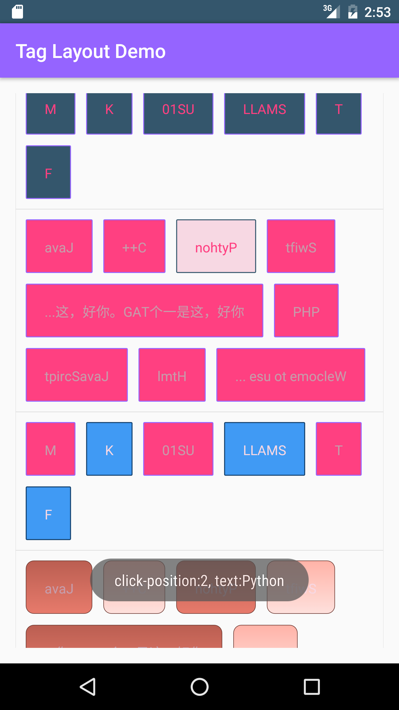
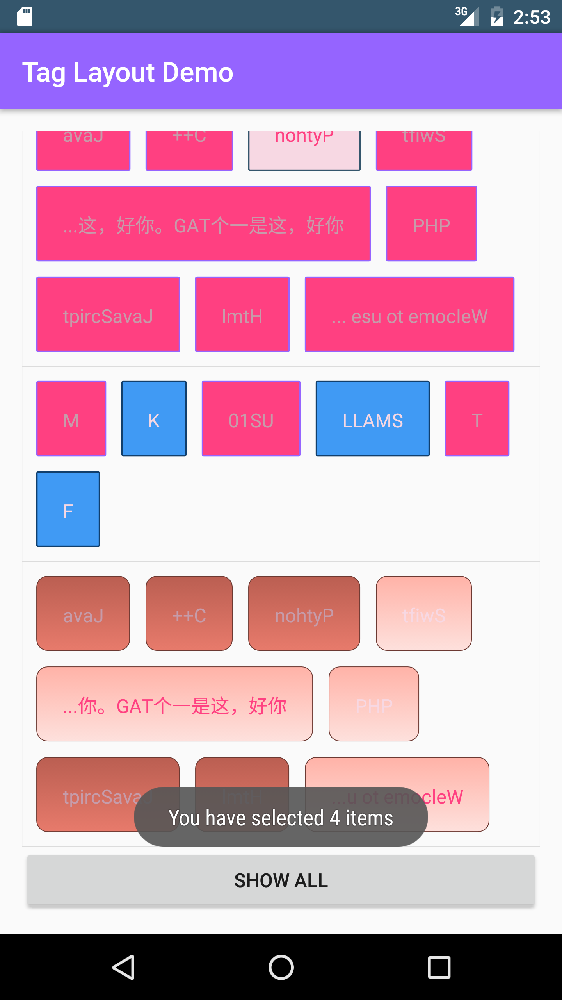

# AndroidTagView
An Android TagView library. You can customize awesome TagView by using this library.

## Usage

### Step 1

Add below dependency in your **build.gradle** file.

```gradle
dependencies {
    compile 'com.hkm.taglib:tag:1.6.0'
}
```

### Step 2

Use the AndroidTagView in layout file, you can add customized attributes here.

```xml
<com.hkm.soltag.TagContainerLayout
    android:layout_width="match_parent"
    android:layout_height="wrap_content"
    android:layout_margin="0dp"
    android:padding="10dp"
    app:container_enable_drag="false"
    app:horizontal_interval="10dp"
    app:vertical_interval="10dp"
    app:tag_fontface="fontname.ttf"
    app:tag_theme="pure_teal" />
```


### Step 3

Use TagView in your code.

```java
TagContainerLayout mTagContainerLayout = (TagContainerLayout) findViewById(R.id.tagcontainerLayout);
mTagContainerLayout.setTags(List<String> tags);
```

Now, you have successfully created some TagViews. The following will show some more useful features for you customize.

## Attributes

|name|format|description|
|:---:|:---:|:---:|
| vertical_interval | dimension | Vertical interval, default 5(dp)
| horizontal_interval | dimension | Horizontal interval, default 5(dp)
| container_border_width | dimension | TagContainerLayout border width(default 0.5dp)
| container_border_radius | dimension | TagContainerLayout border radius(default 10.0dp)
| container_border_color | color | TagContainerLayout border color(default #22FF0000)
| container_background_color | color | TagContainerLayout background color(default #11FF0000)
| container_enable_drag | boolean | Can drag TagView(default false)
| container_drag_sensitivity | float | The sensitive of the ViewDragHelper(default 1.0f, normal)
| container_gravity | enum | The TagContainerLayout [gravity](#gravity)
| tag_border_width | dimension | TagView Border width(default 0.5dp)
| tag_corner_radius | dimension | TagView Border radius(default 15.0dp)
| tag_horizontal_padding | dimension | Horizontal padding for TagView, include left and right padding(left and right padding are equal, default 20px)
| tag_vertical_padding | dimension | Vertical padding for TagView, include top and bottom padding(top and bottom padding are equal, default 17px)
| tag_text_size | dimension | TagView Text size(default 14sp)
| tag_bd_distance | dimension | The distance between baseline and descent(default 5.5px)
| tag_text_color | color | TagView text color(default #FF666666)
| tag_border_color | color | TagView border color(default #88F44336)
| tag_background_color | color | TagView background color(default #33F44336)
| tag_max_length | integer | The max length for TagView(default max length 23)
| tag_theme | enum | The TagView [theme](#themes)
| tag_drawable | drawable | The list item drawable for selection
| tag_text_direction | enum | The TagView text [direction](#directions)
| tag_fontface | string | the custom font face name where is file is located at 'Assets/fonts/' folder.
| tag_drawable_state0 | drawable | The default state of the drawable from the resource folder
| tag_drawable_state1 | drawable | The active state of the drawable form the resource folder
| tag_drawable_state2 | drawable | The preselected state of the drawable form the resource folder

**You can set these attributes in layout file, or use setters(each attribute has get and set method) to set them.**

## <span id="themes">Themes</span>

|theme|code|value|description
|:---:|:---:|:---:|:---:|
| none | ColorFactory.NONE | -1 | If you customize TagView with your way, set this theme
| random | ColorFactory.RANDOM | 0 | Create each TagView using random color
| pure_cyan | ColorFactory.PURE_CYAN | 1 | All TagView created by pure cyan color
| pure_teal | ColorFactory.PURE_TEAL | 2 | All TagView created by pure teal color

## <span id="directions">Directions</span>

|direction|code|value|description
|:---:|:---:|:---:|:---:|
| ltr | View.TEXT_DIRECTION_LTR | 3 | Text direction is forced to LTR(default)
| rtl | View.TEXT_DIRECTION_RTL | 4 | Text direction is forced to RTL

## <span id="gravity">Gravity</span>

|gravity|code|value|description
|:---:|:---:|:---:|:---:|
| left | Gravity.LEFT | 3 | Push TagView to the left of TagContainerLayout(default)
| center | Gravity.CENTER | 17 | Push TagView to the center of TagContainerLayout
| right | Gravity.RIGHT | 5 | Push TagView to the right of TagContainerLayout

## <span id="Methods">Methods</span>

* Set a ```TagView.OnTagClickListener``` for TagView, for ```onTagClick``` and ```onTagLongClick``` callback
```java
mTagContainerLayout.setOnTagClickListener(new TagView.OnTagClickListener() {

    @Override
    public void onTagClick(int position, String text) {
        // ...
    }

    @Override
    public void onTagLongClick(final int position, String text) {
        // ...
    }
});
```
* Use ```setTagMaxLength(int max)``` to set text max length for all TagView.
```java
mTagContainerLayout.setTagMaxLength(int max);
```
* Use ```getTagText(int position)``` to get TagView text at the specified location.
```java
String text = mTagContainerLayout.getTagText(int position);
```
* ```getTags()``` return a string list for all tags in TagContainerLayout.
```java
List<String> list = mTagContainerLayout.getTags();
```
* If you set the attribute ```container_enable_drag``` to ```true```, when drag the TagView you can get latest state by using ```getTagViewState()```. There are 4 state:```ViewDragHelper.STATE_IDLE```, ```ViewDragHelper.STATE_DRAGGING```, and ```ViewDragHelper.STATE_SETTLING```.
```java
int state = mTagContainerLayout.getTagViewState();
```
* Set the [theme](#themes). If you want to customize theme, remember set theme with ```ColorFactory.NONE``` first, then set other attributes.
```java
// Set library provides theme
mTagContainerLayout.setTheme(ColorFactory.PURE_CYAN);
```
```java
// Set customize theme
mTagContainerLayout.setTheme(ColorFactory.NONE);
mTagContainerLayout.setTagBackgroundColor(Color.TRANSPARENT);
```
* Set the text [direction](#directions). The library support two direction ```View.TEXT_DIRECTION_LTR``` and ```View.TEXT_DIRECTION_RTL```.
```java
mTagContainerLayout.setTagTextDirection(View.TEXT_DIRECTION_RTL);
```
* Use ```setTagTypeface(String typefacename)``` to set TagView text typeface. Please make sure your custom font file is located at the 'fonts' folder
```java
mTagContainerLayout.setTagTypeface("iran_sans.ttf);

```

**After set the attributes, set tags or add a tag.**

* Use ```setTags()``` to set tags, require a parameter of type ```List<String>``` or ```String[]```.
```java
mTagContainerLayout.setTags(List<String> tags);
```
* Insert a TagView into ContainerLayout at the end.
```java
mTagContainerLayout.addTag(String text);
```
* Insert a TagView into ContainerLayout at the specified location, the TagView is inserted before the current element at the specified location.
```java
mTagContainerLayout.addTag(String text, int position);
```
* Remove TagView on particular position, require the position of the TagView
```java
mTagContainerLayout.removeTag(int position);
```
* Remove all TagViews.
```java
mTagContainerLayout.removeAllTags();
```

## Change logs

## Sample App
[APK](/storage/sample-release.apk)

## Screenshots




## License

    Copyright 2015 hkm jet fighter-101

    Licensed under the Apache License, Version 2.0 (the "License");
    you may not use this file except in compliance with the License.
    You may obtain a copy of the License at

     http://www.apache.org/licenses/LICENSE-2.0

    Unless required by applicable law or agreed to in writing, software
    distributed under the License is distributed on an "AS IS" BASIS,
    WITHOUT WARRANTIES OR CONDITIONS OF ANY KIND, either express or implied.
    See the License for the specific language governing permissions and
    limitations under the License.